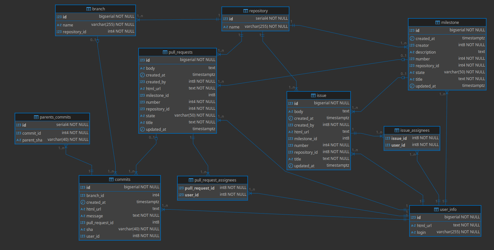

# Oráculo - Relatório 4ª Entrega

  

**Integrantes:** Alicia Caporali, Livia Hombre, Pedro Henrique, Thiago Fabiano

  

## 1. Introdução

O projeto Oráculo é uma plataforma de chatbot criada para facilitar o acesso a informações sobre o andamento de tarefas em equipes de desenvolvimento. Com ele, gestores e desenvolvedores conseguem saber, por exemplo, "em que tarefa o membro X está trabalhando agora?", apenas perguntando em linguagem natural.

  

O Oráculo busca tornar mais rápido e fácil o processo de acompanhar o status de projetos, integrando dados do GitHub e usando inteligência artificial para interpretar perguntas e devolver respostas claras e objetivas.

  

## 2. Implementações da 4° Entrega

  

Observamos que a IA não estava respondendo algumas perguntas corretamente e isso acontecia devido a inconsistência de alguns dados no banco, pois por exemplo dados relativos a usuários eram salvos em formato JSON nas tabelas, contendo em uma única célula vários dados relativos ao usuário e seu perfil no Github. Com isso decidimos elaborar uma view para melhor visualização desses dados, extraindo os dados coletados, transformando-os e inserindo no novo banco criado.

  

### Estrutura de Dados Melhorada

Inicialmente, utilizamos a estrutura de dados definida pelo airbyte. Consistia em tabelas no banco de dados, onde esses dados persistiam, porém, não era um banco de dados devidamente relacional, e alguns dos dados não eram tratados. Por exemplo: algumas colunas recebiam um objeto JSON  inteiro como valor, fazendo com que seja impraticável aplicar o Vanna para devolver queries relevantes.

A nova estrutura de dados soluciona dois problemas:
1. Destination-postgres: Última etapa do processo de ETL do airbyte, onde ele salva os dados requisitados pela api no banco de dados, definitivamente a parte mais difícil de fazer funcionar do airbyte.
2. Vanna: Faz com que seja mais fácil o Vanna entender a modelagem e isso resulta em uma melhor construção queries para entregar ao Gemini.
    
A solução foi trazer os dados pelo cache do airbyte, ele salva os dados momentâneamente antes de inseri-los no banco de dados, e manipulá-los para inserirmos manualmente em uma modelagem customizada.

Representação gráfica do novo modelo do banco de dados:

Assim, podemos aproveitar de alguns campos únicos do github , como: id do usuário, id da issue, id da milestone, ... em alguns outros casos que não retornam ids da api, criamos no banco com auto-increment e se necessário faz um select antes de uma nova inserção onde precisa de uma foreign-key.

### Testes de Qualidade da IA

  

Além disso, afim de manter qualidade e confiabilidade do código, foram inseridos testes relativos à qualidade de resposta da IA. Para isso foi utilizado o Google BERT (modelo de linguagem que analisa a similaridade semântica entre textos).

  

#### Como os Testes Funcionam

  

Os testes de qualidade foram implementados na classe [`TestAIResponseQuality`](tests/unit/test_ai_response.py) e funcionam da seguinte forma:

  

1.  **Configuração de Thresholds**: Definidos em [`config_bert_tests.py`](tests/config_bert_tests.py) com diferentes níveis de qualidade:

-  `HIGH_QUALITY`: 0.8 (80% de similaridade)

-  `MEDIUM_QUALITY`: 0.6 (60% de similaridade)

-  `LOW_QUALITY`: 0.4 (40% de similaridade)

  

2.  **Avaliação por BERT**: O sistema utiliza o modelo `neuralmind/bert-base-portuguese-cased` para:

- Calcular embeddings (vetores numéricos que representam o significado do texto) das consultas SQL esperadas e geradas

- Medir similaridade semântica usando cosine similarity (mede quão similares são dois vetores calculando o ângulo entre eles, retornando valores de -1 (opostos) a 1 (idênticos).)

- Comparar com thresholds pré-definidos ( valores para comparação da resposta da IA)

  

3.  **Casos de Teste**: Incluem perguntas sobre:

INSERIR Casos e Prints dos logs

  

4.  **Processo de Validação**: Para cada pergunta:

- A IA gera uma consulta SQL

- O BERT calcula a similaridade com o padrão esperado

- O teste falha se a similaridade for menor que 60% (MEDIUM_QUALITY)

- Logs detalhados mostram pergunta, SQL gerado e score de similaridade

  

## 3. Padrões Aplicados

  

### Padrão Singleton

Implementado em [`singleton.py`](src/assets/pattern/singleton.py) para garantir uma única instância de componentes críticos como conexões de banco de dados e configurações da IA.

  

### Padrão MVC (Model-View-Controller)

-  **Model**: Classes de dados e lógica de negócio em [`src/api/models/`](src/api/models/)

-  **View**: Interface OpenWebUI e endpoints REST

-  **Controller**: [`AskController.py`](src/api/controller/AskController.py) gerencia as requisições e coordena respostas

  

### Arquitetura em Camadas

-  **ETL Layer**: [`airbyte.py`](src/etl/airbyte.py) para extração de dados

-  **API Layer**: FastAPI com endpoints em [`routes.py`](src/api/endpoints/routes.py)

-  **Database Layer**: [`MyVanna.py`](src/api/database/MyVanna.py) para interação com IA e banco

-  **Presentation Layer**: OpenWebUI para interface de usuário

  

### Dependency Injection

Utilizado através de fixtures do pytest em [`conftest.py`](tests/conftest.py) para injeção de dependências nos testes.

## 4. Padrões Não Aplicados e Porquê

  

### Repository Pattern

**Não aplicado** porque o Vanna.AI já abstrai o acesso aos dados através de sua própria interface, eliminando a necessidade de uma camada adicional de abstração de repositório.

### Observer Pattern

**Não aplicado** pois o sistema atual é baseado em requisição-resposta síncrona, não havendo necessidade de notificações de mudanças de estado em tempo real.

### Command Pattern

**Não aplicado** porque as operações são diretas (pergunta → SQL → resposta) sem necessidade de enfileiramento, desfazer operações ou logging complexo de comandos.

